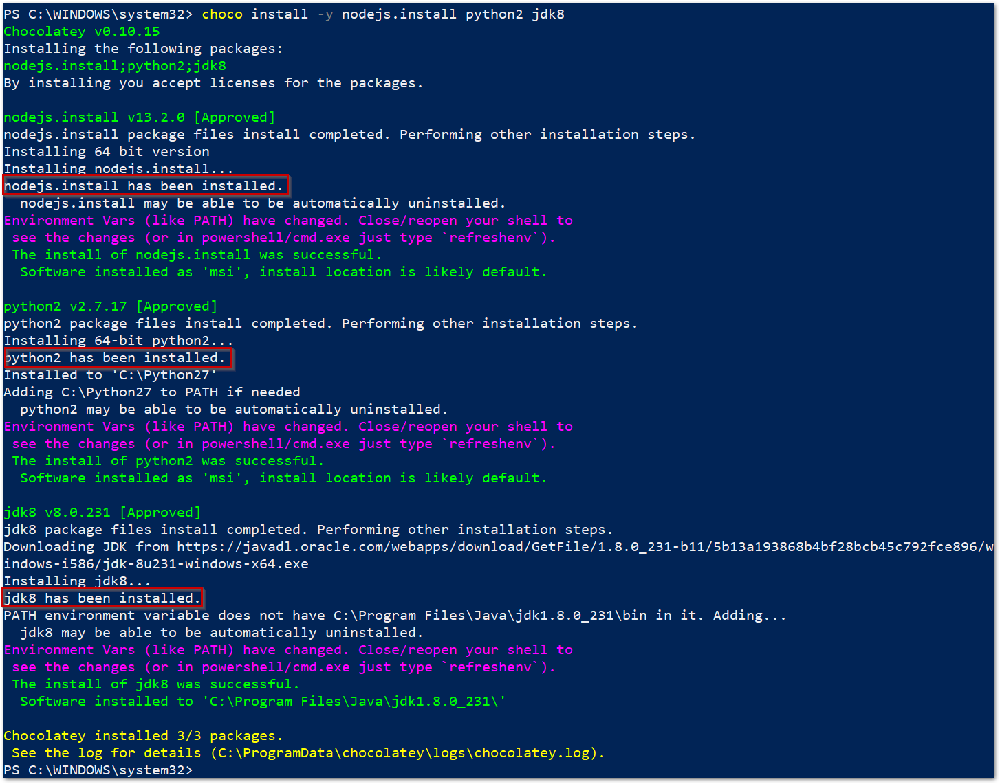
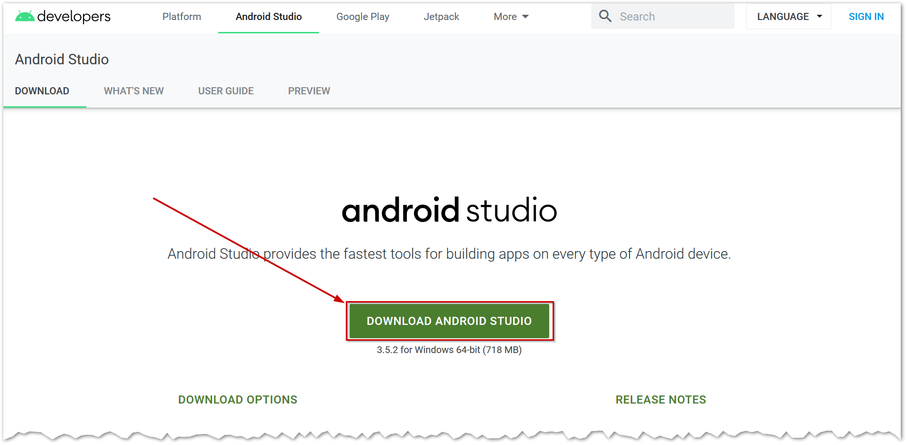
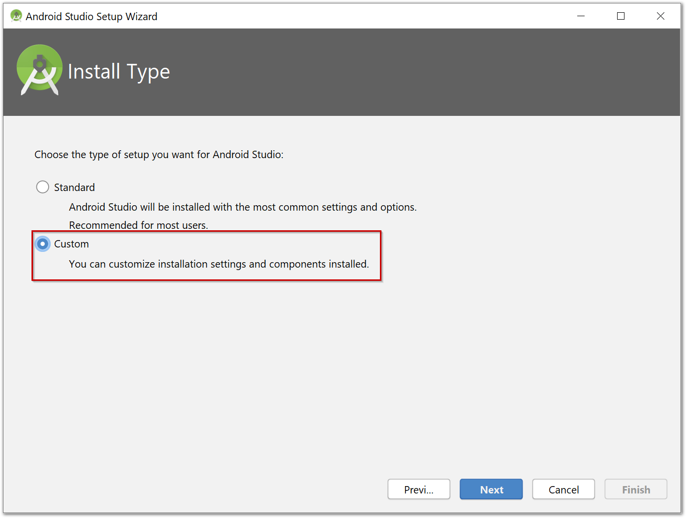
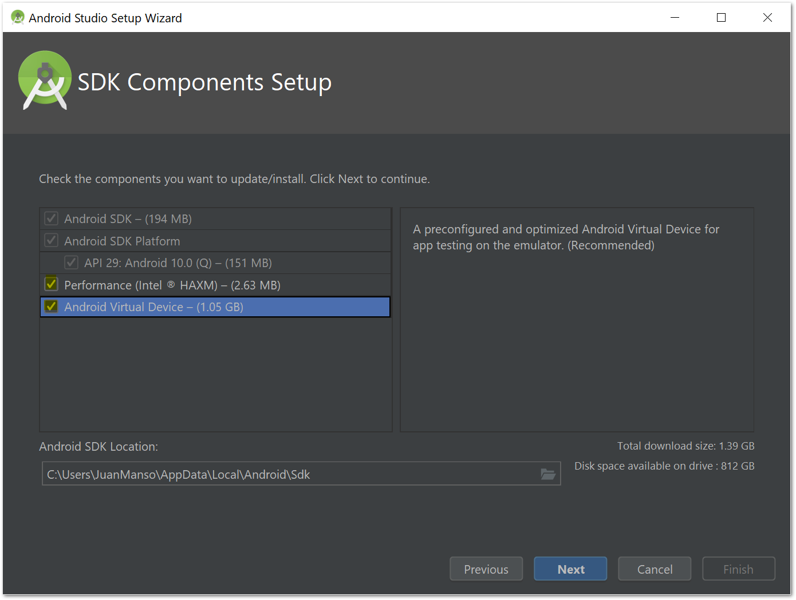
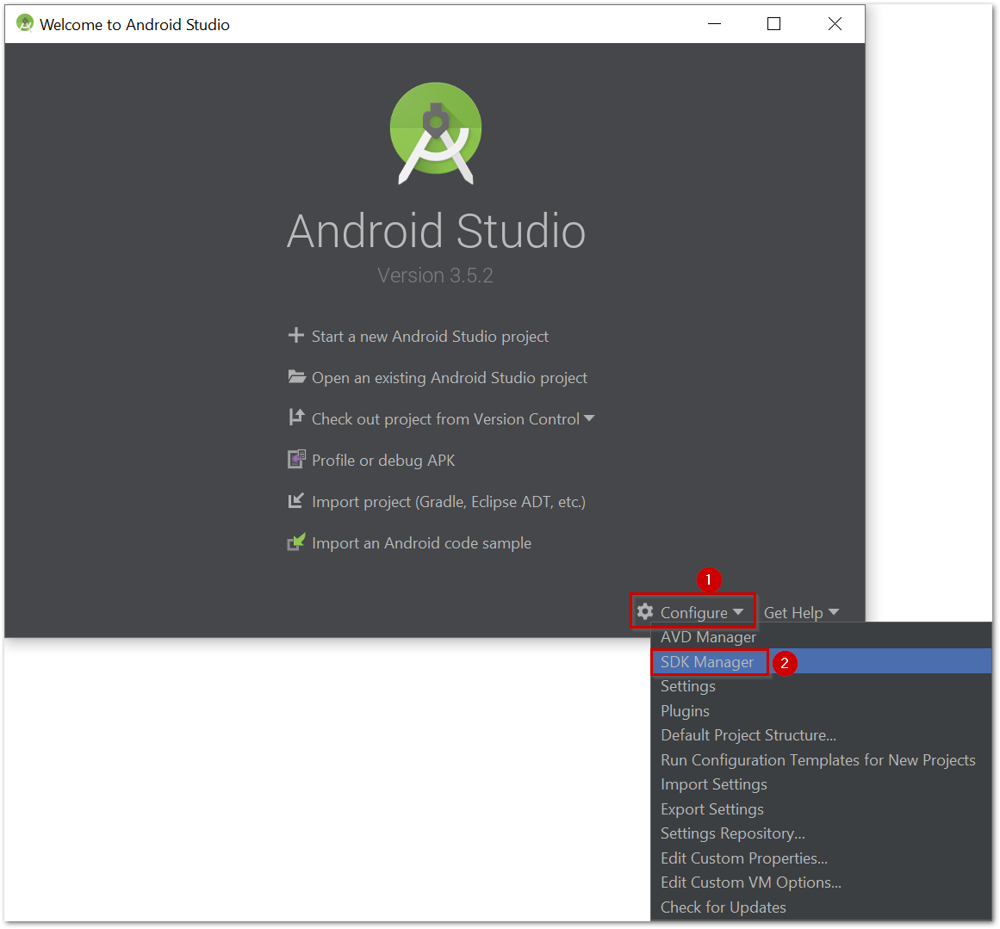
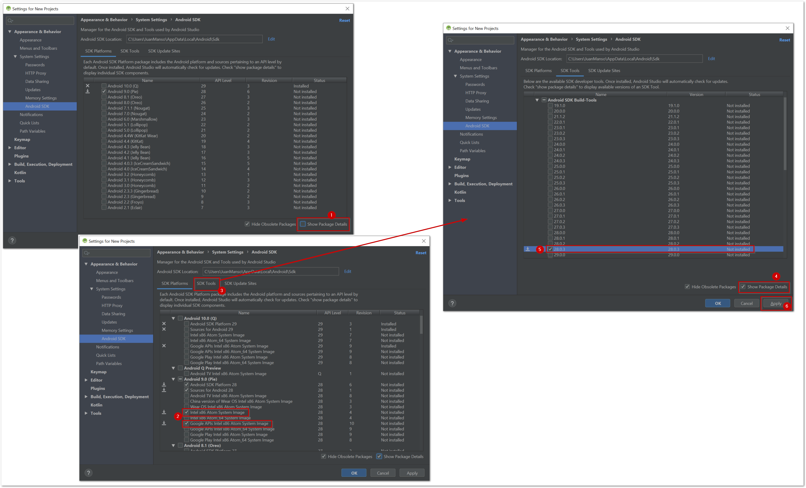
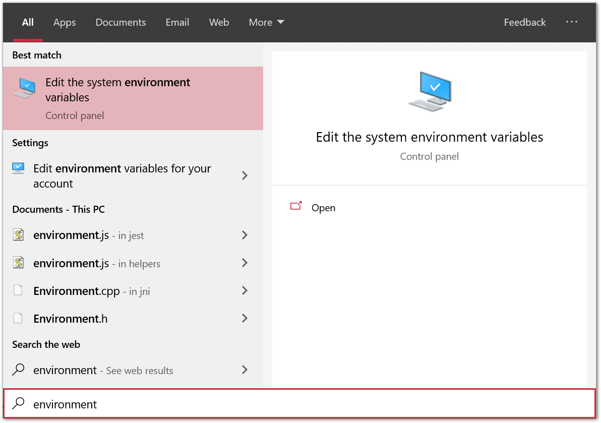
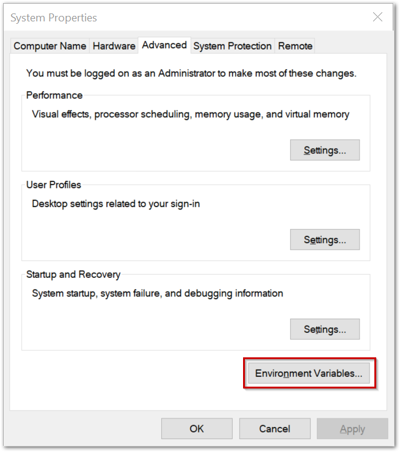
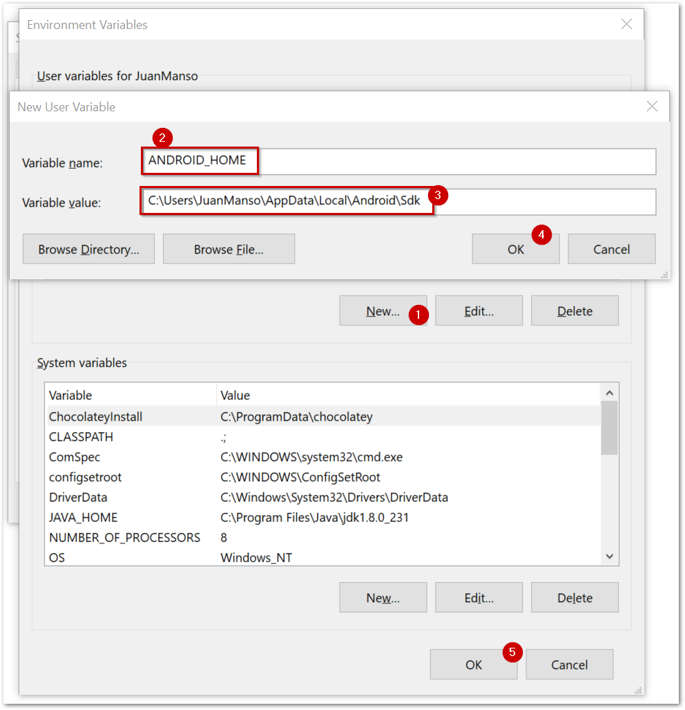
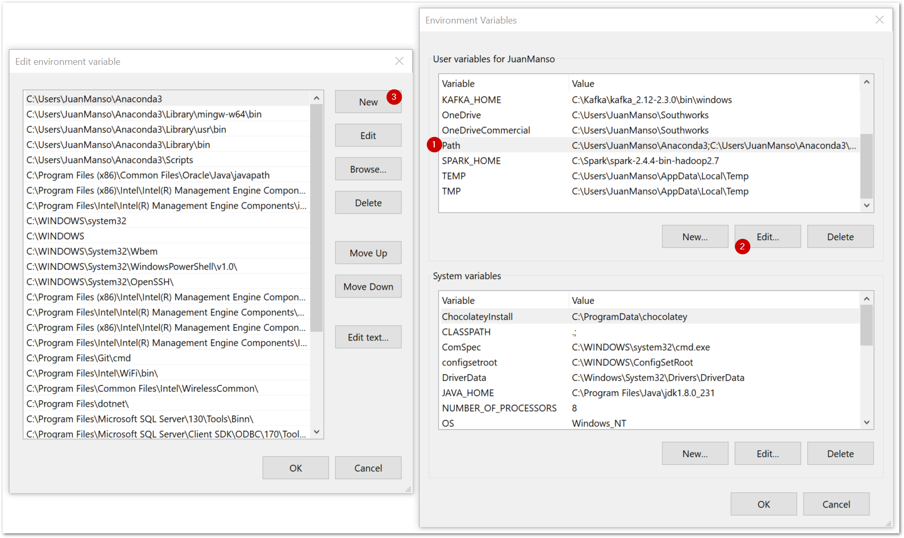

# React Native CLI Quickstart on Windows
<!-- toc -->

- [Install dependencies](#Install-Dependencies)
- [Android Development Environment](#Android-dev-environment)

<!-- end toc -->

### Overview
This quickstart is aimed to help developers do their first steps with React Native to create a mobile app. It is bounded to a simple example, but for more information you can follow the links below:

- [Components and APIs](https://facebook.github.io/react-native/docs/components-and-apis.html)
- [Basics - Props](https://facebook.github.io/react-native/docs/props)
- [Basics - State](https://facebook.github.io/react-native/docs/state)
- [Libraries - Awesome React Native](http://www.awesome-react-native.com/)
- [React Apps Examples](https://github.com/ReactNativeNews/React-Native-Apps)

On this particular file, we will be tackling the environment setup of the quickstart while on [this other file](./first-steps-android), we will be doing our first steps with Android and React Native.

## Install dependencies

Before doing anything we need to install `NodeJS`, `Python2` and `Java JDK 8` using [Chocolatey](https://chocolatey.org/):

```
choco install -y nodejs.install python2 jdk8 
```

After running it, you should see a screen like the one displayed below



## Android dev environment
### Install Android Studio

Follow [this link](https://developer.android.com/studio/index.html) to download Android Studio.



When downloaded, run the `.exe` file and follow the installation process until the following screen pops up:



We need to select the `Custom` option. Then, we will cross all the boxes like the picture below:



Next, we will come up with Android Studio's Welcome Screen. For developing a React Native app, it requires `Android 9 (Pie) SDK`. First we click on "Configure" and then select "SDK Manager" as shown:



Then, follow this steps:

1. Click on Show Package Details inside SDK Platforms.
2. Check either `Intel x86 Atom System Image` or `Google APIs Intel x86 Atom System Image` (chose both if you like).
3. Then click the `SDK Tools` tab.
4. Click again on Show Package Details.
5. Select the `28.0.3` Build.
6. Apply your changes.



Last but not least, we need to set two environment variables. To do that, we need to go to control panel in the `Edit the system environment variables`.



Clicking in the advanced tab, we enter to the environment variables below.



Now we will load the `ANDROID_HOME` env var following the steps noted below. The default `HOME` is
```
C:\Users\<YOUR_USERNAME>\AppData\Local\Android\Sdk
```


We also need to set the path for the Android Studio, so we do as listed below using the default directory:
```
C:\Users\<YOUR_USERNAME>\AppData\Local\Android\Sdk\platform-tools
```


Now we will do our [first steps with Android and React Native](./first-steps-android) by creating a basic app and running it locally.