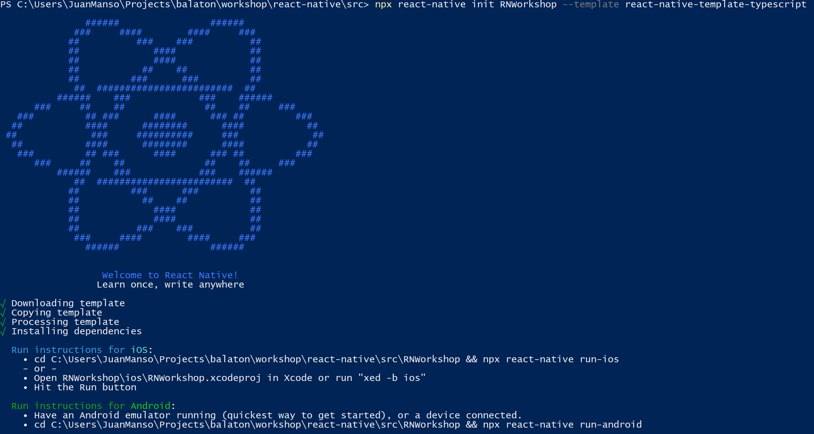
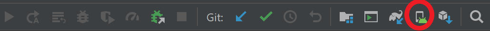
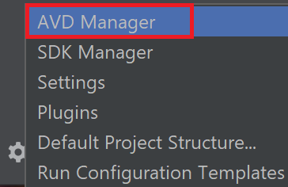
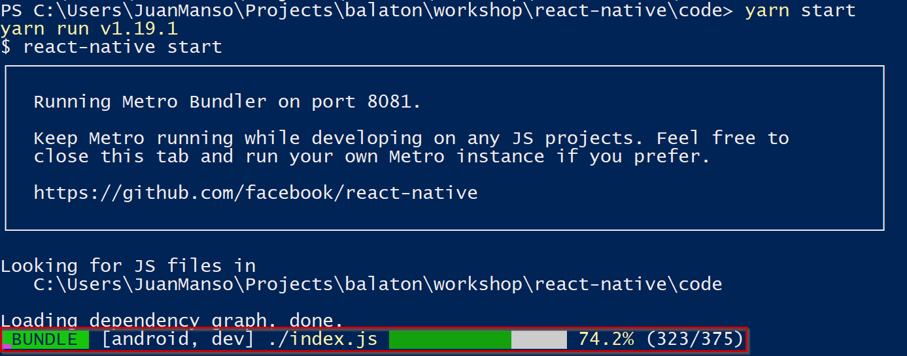
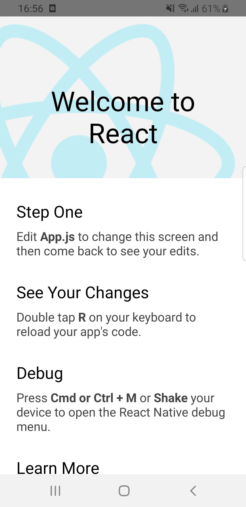

## Getting started with React Native for Android development

Once we have our environment ready, let's put our hands on a brief quickstart in order to learn the basics.
First of all, we'll need to generate a new project. For this example, we will be using React Native built-in command line interface. First head to your preferred working directory and then run the command below:

``` 
npx react-native init <PROJECT-NAME> --template react-native-template-typescript
```
This will generate a new project with a basic template using Typescript ready to run on our Android device as shown in the image below.



The following step should be creating one or any amount of devices in order to test our application. Now you should pick whatever device you'll be working with and select an Android version for each as well.
Using Android Studio, adding devices is simple as clicking here:



and once there just click Create Virtual Device and pick your preferred device(s) from the available ones.


This will generate an emulated device where you can test your application.

Alternatively, you can also crete new devices without opening/importing your project to Android Studio. From the Welcome screen, just click the `Configure` button and then `AVD Manager`.




and once again, you will reach a screen where you will be able to pick any existing virtual device or create a new one.


Ìf you instead want to use a physical device for testing purposes, you'll have to first enable Developer Tools by going to `Settings -> About Phone -> Software Information`  and once there, tap over _Build Number_ seven times. Now you can head back to `Settings -> Developer Options` and enable _**USB Debugging**_ option.
That's pretty much everything, once you are done with the steps above, you are ready to plug your device in via USB and start running the application on it.
To check if your device is ready to deploy, type:
```
adb devices
```
The outptut should be something like this, where your device is listed and ready to go.


### Running the application

Finally, when it comes to running the app, you can run your project entirely from the command line. However, your device (either physical or virtual) must be up and ready to run the application prior to running this command.
```
yarn android
```
If you are using an `iOS` device, `yarn ios` does the trick. Both of them launch also a Metro server instance. Metro is a JavaScript bundler for `React Native` and we will use it only to run the app but it can do a bunch of stuff. For more information, please check [their official site](https://facebook.github.io/metro/docs/en/concepts). 

On the other hand, to avoid pop ups, you can launch your own Metro server instance with:
```
yarn start
```
If you instead are familiarized with Android Studio and prefer doing it from the IDE, all you have to do is hit the `Run` button after starting the packager by running `yarn start` when inside project's directory.

Below you can find an example of a Metro instance working. After running `yarn android` the `BUNDLE` progress bar comes up showing the upload of the app to the device.



And that's it! If you followed the steps above, you should be seeing this screen on your device:

