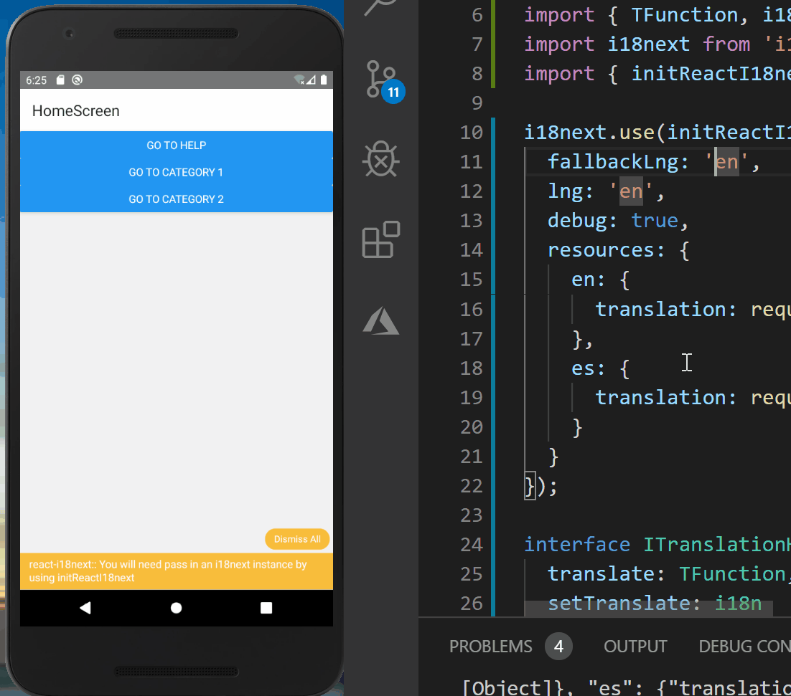
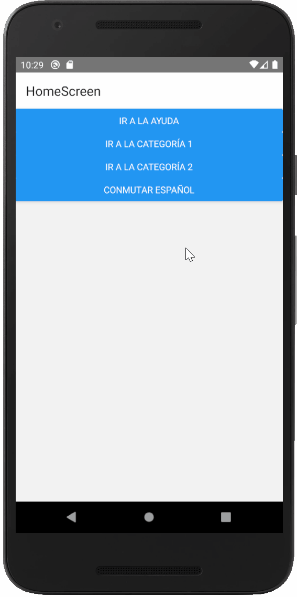

# Localization and Internationalization

- [Differences between them](#Differences-between-them)
    - [Internationalization (i18n)](#Internationalization-(i18n))
    - [Localization (L10n)](#Localization-(L10n))
- [Setup](#Setup)
- [Next Steps](#Next-Steps)
- [Bonus track - Hooks on Class components](#Bonus-track---Hooks-on-Class-components)
- [References](#References)

## Differences between them
So, we want to support our apps on any language and to handle formats like the user expects, right? How do we accomplish such feature?

> The answer is localization and internationalization.

But, what do they mean? What are the differences between them? 

To answer those questions, we will borrow [Akshay Kadam's own explanation](https://lokalise.com/blog/react-native-localization/) about it.

### Internationalization (i18n)
Internationalization is the process of **designing software** that is *capable of adapting* to language and region based user experiences without engineering changes.
> Fun fact, `i18n` is a [numeronym](https://en.wikipedia.org/wiki/Numeronym) for “internationalization” as there are exactly 18 characters between `i` and `n`. The same goes for localization (`L10n`).

| `i18n` involves: | Benefits of `i18n` |
| :--------------: | :----------------: |
| Collocating hard-coded text in a single place for easier editing. | Maintenance becomes easy for future iterations of the software. |
| Support for right-to-left (RTL) languages, such as Urdu, Arabic, Hebrew, and Persian. | Customer satisfaction. |


### Localization (L10n)
Localization is the process of **adapting** software for a specific region or language by *translating text and adding locale-specific components*.
> If `L10n` is not done right, it can be [pretty hilarious and sad at the same time](https://www.inc.com/geoffrey-james/the-20-worst-brand-translations-of-all-time.html)

Thus, we need internationalization to apply localization.

| `L10n` involves: | Benefits of `L10n` |
| :--------------: | :----------------: |
| Support for appropriate date, time and calendar format | Increase market share |
|Optimizing graphics and messaging to meet the tastes and habits of the market | Gain a competitive advantage |


## Setup
There are a bunch of ways to setup localization/i18n using a mixture of different libraries (see [Reference section](#reference)) but we are going to use `react-native-localize` for localization and `react-i18next` for internationalization.

First, we need to create the `localization` folder under `src` folder (it can also be called `locale` or `i18n`). In there, we'll put each translation `.json` file for each supported language. In this case, we'll create just `en.json` and `es.json` files with a few translations to make our point. Here is an example for the `en.json` file:
```ts
export const enT = {
  'go to category': 'Go to Category',
  'go to help': 'Go to Help',
  category: 'Category',
  return: 'Return',
  toggle: 'Toggle',
  'current language': 'English'
};
```
> **Spoiler**: As we will using a translate function `t()`, our text strings will look something like `t('go to category')`. So, if we create our translation files naming the attributes as their sentence, code will be easier to read.

Then, we need to install the needed libraries:
```cmd
yarn add react-native-localize i18next react-i18next
```

### Internationalization 
Let's start by refactoring the code with `i18next`. For each displayed text that we want to make it flexible, we need to replace it for a variable stated on the translations files. Let's see an example below:
```ts
class HomeScreen extends React.PureComponent<IHomeScreen> {
  render() {
    const { navigate } = this.props.navigation;
    return (
      <>
        <Button
          title="Go to Help"
          onPress={() =>
            navigate(routeNames.Help, {
              id: Math.floor(Math.random() * 100)
            })
          }
        />
        <Button
          title="Go to category 1"
          onPress={() =>
            navigate(routeNames.Category1, {
              id: Math.floor(Math.random() * 100)
            })
          }
        />
        <Button
          title="Go to category 2"
          onPress={() =>
            navigate(routeNames.Category2, {
              id: Math.floor(Math.random() * 100)
            })
          }
        />
      </>
    );
  }
}
```
Now let's replace each button title for their corresponding var
```ts
class HomeScreen extends React.PureComponent<IHomeScreen> {
  render() {
    const { navigate } = this.props.navigation;
    return (
      <>
        <Button
          title={t('go to help')}
          onPress={() =>
            navigate(routeNames.Help, {
              id: Math.floor(Math.random() * 100)
            })
          }
        />
        <Button
          title={t('go to category') + ' 1'}
          onPress={() =>
            navigate(routeNames.Category1, {
              id: Math.floor(Math.random() * 100)
            })
          }
        />
        <Button
          title={t('go to category') + ' 2'}
          onPress={() =>
            navigate(routeNames.Category2, {
              id: Math.floor(Math.random() * 100)
            })
          }
        />
      </>
    );
  }
}
```
We'll also add a button to switch between languages using a local state:
<!-- TODO: Switch it to Redux -->
```ts
onLanguageChanged(lng: string) {
  this.setState({
    lng: lng
    }, () => i18next.changeLanguage(this.state.lng))
  }
.
.
.
<Button
  title={t('Toggle') + ' ' + t('current language')}
  onPress={ () =>
    this.onLanguageChanged(this.state.lng === 'en' ? 'es' : 'en')
  }
/>
```

Another way of switching between languages:
```ts
componentDidMount() {
  i18next.on('languageChanged', this.onLanguageChanged)
}
componentWillUnmount() {
  i18next.off('languageChanged', this.onLanguageChanged)
}

onLanguageChanged() {
  this.setState({
    lng: i18next.language
  })
}
.
.
.
<Button
  title={t('toggle') + ' ' + t('current language') }
  onPress={ () =>
    i18next.changeLanguage(this.state.lng === 'en' ? 'es' : 'en')
  }
/>
```
Below you can find a demo of the app (_without the button_):



Now, let's add localization!

### Localization

[Some may say](https://itnext.io/ultimate-localization-of-react-mobx-app-with-i18next-efab77712149) that is useless to get another library to perform localization but we thought it had its perks:
- `react-native-localize` has a bunch of locale data to work with as shown on the image below


- Also, following this workshop you will have everything setup to either use just one of them, or both. You could replace one of them with the library of your choosing too!

With that out of the way, the setup we did was very straight forward. We just needed to get locale language setting and feed it to `i18next`. To do so we paste this on `localization/i18n.ts`:
```ts
import i18next from 'i18next';
import { initReactI18next } from 'react-i18next';
import * as RNLocalize from 'react-native-localize';

const locale = RNLocalize.getLocales();

i18next.use(initReactI18next).init({
  fallbackLng: 'en',
  lng: locale[0].languageCode,
  debug: true,
  resources: {
    en: {
      translation: require('./translations/en.json')
    },
    es: {
      translation: require('./translations/es.json')
    }
  }
});

export default i18next
```

Below you'll find a demo of the app changing locales of the phone. You can see that we are reloading the app to use the new locale configuration. That's not something we want on a production app, but to accomplish this you can look for the [event listener documentation of `react-native-localize`](https://github.com/react-native-community/react-native-localize#addeventlistener--removeeventlistener).



<!-- TODO: Refactor following [lokalise.com](https://lokalise.com/blog/react-native-localization/) tutorial using AsyncStorage and Redux/Context -->

## Next Steps
In this section, we want to mention some improvements and interesting things that can be achieved with localization and internationalization that escape the scope of this workshop.
- [Continuous Translation - i18next & Weblate](https://alcalyn.github.io/set-up-continuous-translation-i18next-weblate/)
- [React i18n - Best libraries](https://phrase.com/blog/posts/react-i18n-best-libraries/)

## Bonus track - Hooks on Class components

To have access to `useTranslation()` response attributes inside of the `HomeScreen` component we have to use HOC (Higher-Order Components).

One of the `Rules of Hooks` is that they cannot be called inside of a Class Component. The solution is using a wrapper that pass as `props` the output of the hook to the actual component.

For the workshop we did this implementation on `localization/hoc.tsx` file:
```ts
import React from 'react';
import { TFunction, i18n } from 'i18next';
import { useTranslation } from 'react-i18next';

export interface ITranslationHOCProps {
  translate: TFunction;
  setTranslate: i18n;
}

export const translationHOC = (Component: any): any => {
  return (props: any) => {
    const { t, i18n } = useTranslation();
    return <Component translate={t} setTranslate={i18n} {...props} />;
  };
};
```

Then we import `translationHOC` to the `HomeScreen` and do the following changes:
```ts
interface IHomeScreen extends ITranslationHOCProps {
  navigation: NavigationStackProp<{}>;
}
.
.
.
export default translationHOC(HomeScreen);
```

More on Hooks/HOC can be found below:
- [React - Invalid Hook Call Warning](https://reactjs.org/warnings/invalid-hook-call-warning.html)
- [React - Higher-Order Components](https://reactjs.org/docs/higher-order-components.html)
- [How to use React Hooks in Class Components](https://infinum.com/the-capsized-eight/how-to-use-react-hooks-in-class-components)
- [Hooks with React & React Native](https://blog.usejournal.com/hooks-with-react-react-native-%EF%B8%8F-a3227609e512)

## References
- [React Native Localization and Internationalization](https://lokalise.com/blog/react-native-localization/)
- [Creating a Multi-Language App in React Native](https://medium.com/better-programming/creating-a-multi-language-app-in-react-native-9828b138c274)
- [react-native-localize and i18n-js](https://medium.com/@nicolas.kovacs/react-native-localize-and-i18n-js-117f09428017)
- [Step by step guide v9 - `react-i18next`](https://react.i18next.com/legacy-v9/step-by-step-guide)
- [Ultimate Localization of React (Mobx) App with i18next](https://itnext.io/ultimate-localization-of-react-mobx-app-with-i18next-efab77712149)
- [I18n with React and i18next](https://alligator.io/react/i18n-with-react-and-i18next)


### Libraries
- [`react-native-localize`](https://github.com/react-native-community/react-native-localize)
- [`react-native-localization`](https://github.com/stefalda/ReactNativeLocalization)
- [`i18next`](https://www.i18next.com/)
- [`react-i18next`](https://github.com/i18next/react-i18next)
  - [What is react-i18next](https://react.i18next.com/)
  - [Create own Plugins](https://www.i18next.com/misc/creating-own-plugins#creating-own-plugins)
  - [Translate your content](https://react.i18next.com/guides/quick-start#translate-your-content)
- [`i18n-js`](https://github.com/fnando/i18n-js)

