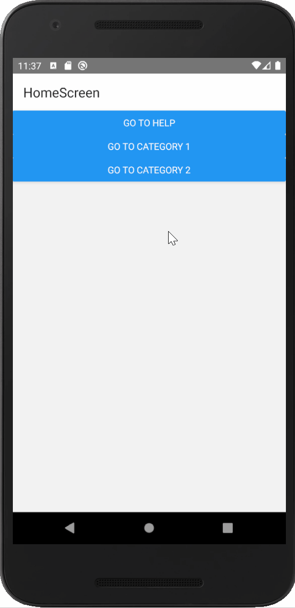

# Navigation

- [Overview](#overview)
- [Setup React Navigation](#setup-react-navigation)
- [Demo](#demo)
- [References](#references)

## Overview 
When we talk about _"Navigation"_, we mean handling the presentation and transitions between multiple screens. Navigation is a vital feature on every piece of software, particularly on mobile apps having a big impact on User Experience (UX).

Here, we will consider two different navigation libraries for `React Native`:
- `react-navigation`
- `react-router-native`

On one side, we have [Facebook's own recommended lib](https://facebook.github.io/react-native/docs/navigation) [`react-navigation`](https://reactnavigation.org/en/) which is a very complete and straight forward implementation of navigation.

On the other side, it's [`react-router-native`](https://reacttraining.com/react-router/native/guides/quick-start) that is the `React Native` bindings lib from the core library, [React-Router](https://github.com/ReactTraining/react-router). It is also a very good library that proved to be very useful in the past (working on Windows WPF when `react-navigation` didn't).

Having our focus on creating mobile apps, we will be using `react-navigation`.

While developing, we felt that `react-navigation` had a more straight-forward implementation making code simpler. As also stated by [Ian Mundy on his opinion about navigation libraries](https://medium.com/@ian.mundy/choosing-a-routing-library-for-react-native-604f97e58729), documentation is great. Lastly we want to mention, that `react-router-native` would be a better option for `ReactJS` based developments because of its parents (`React Router`) better approach.

> Nonetheless, `react-router-dom` is a key library for DOM bindings on `React Native` when implementing the app for web platforms.

## Setup React Navigation

First of all, we need to install `react-navigation` and their dependencies by running:

```powershell
yarn add react-native-reanimated react-native-gesture-handler react-native-screens react-native-safe-area-context
```
Navigation on `react-navigation` doesn't quiet work like URL navigation does. React-Navigation's Stack also handles gestures and animations. To start implementing navigation on our own app, we must install:

```powershell
yarn add react-navigation-stack @react-native-community/masked-view
```

Now we need to create an `AppContainer`. It is generated by a function that receives a `Navigator`, in this case, a [`Stack Navigator`](https://reactnavigation.org/docs/en/stack-navigator.html) (it could be also a [`TabNavigator`](https://reactnavigation.org/docs/en/tab-based-navigation.html) or a [`DrawerNavigator`](https://reactnavigation.org/docs/en/drawer-based-navigation.html)). What we want to accomplish here is to jump from one screen to another by clicking a link component.

As [Daniel Merrill preaches](https://medium.com/async-la/react-navigation-are-you-the-one-8cf945a4a462):
> A Navigator is just a component

This component will be the backbone of our app, handling props passed from child components with each other and also sharing their parents methods.

For the implementation of `react-navigation`, you can follow [their 'Getting Started' guide](https://reactnavigation.org/docs/en/getting-started.html). 

We will reutilize the main screen of the template and create a `HelpScreen` component out of it. Also we'll create a `HomeScreen` component that will have the set of buttons that will redirect to the other screens. `PlaceholderScreen` will be the component that renders a screen with a given title and receives from params an ID.

Some important things to mention:
- An `AppContainer` is a component that handles navigation set by a `Navigator`.
- To navigate between screens we use the `navigate()` function available on navigation `props` (`this.props.navigation.navigate(routeNames.SOMESCREEN)`)
- On the `navigation` folder, we will find all the needed routes stored on a `routes` constant on the `routes.tsx` file while their names are on `utils.ts` . With the help the latter, all `navigate()` calls are written with the same syntax.
- To pass params to other screens, on the same `navigate` call we do: `this.props.navigation.navigate(route, SOMEPARAM)`

## Demo
A quick demo of the app with a the simple navigation setup.



## References
- [React-Navigation: Getting Started](https://reactnavigation.org/docs/en/getting-started.html)
- [Choosing a Routing Library for React Native](https://medium.com/@ian.mundy/choosing-a-routing-library-for-react-native-604f97e58729)
- [Up and running with React Navigation](https://medium.com/async-la/react-navigation-are-you-the-one-8cf945a4a462)
- [Announcing React Navigation 5.0](https://blog.expo.io/announcing-react-navigation-5-0-bd9e5d45569e)
- [React Navigation: Stacks, Tabs, and Drawers ... Oh my!](https://medium.com/async-la/react-navigation-stacks-tabs-and-drawers-oh-my-92edd606e4db)
- [React Navigation vs. React Native Navigation: Which is right for you?](https://blog.logrocket.com/react-navigation-vs-react-native-navigation-which-is-right-for-you-3d47c1cd1d63/)

### Libraries
- [React Navigation](https://github.com/react-navigation/react-navigation)
    - [Documentation](https://reactnavigation.org/en/)
    - Navigators
        - [Stack Navigator](https://reactnavigation.org/docs/en/stack-navigator.html)
        - [TabNavigator](https://reactnavigation.org/docs/en/tab-based-navigation.html)
        - [DrawerNavigator](https://reactnavigation.org/docs/en/drawer-based-navigation.html)
- [React Router](https://github.com/ReactTraining/react-router)
    - [React Router DOM](https://github.com/ReactTraining/react-router/tree/master/packages/react-router-dom)
    - [Quickstart - RR DOM](https://reacttraining.com/react-router/web/guides/quick-start)
    - [Quickstart - RR Native](https://reacttraining.com/react-router/native/guides/quick-start)

### Presentation
- [Reference PPT for React-Navigation](https://docs.google.com/presentation/d/1NueI5-WnkP8ssGq7VpKEIa6g6QkDULChT7uHaXJ9Tw0/edit#slide=id.g1d87d8784b_0_48)