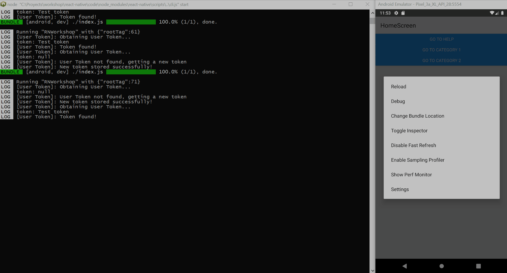

# Storage Caching

- [Overview](#overview)
- [SQLite](#sqlite)
- [AsyncStorage](#async-storage)
- [Setup AsyncStorage](#setup-AsyncStorage)
- [Demo](#demo)
- [References](#references)

## Overview

During the advance of applications on the market, they become more and more complex due to demandant requirements. One of these
requirements is handling big chunks of information and doing it fast. In most cases, an API provides these information from a Backend,
but in some cases it's not recommended to consume APIs continuously. If information won't change during some period of time
it's better to store it somewhere and retrieve it when needed.

Here is where **Storage Caching** comes in to save our lives. A Storage Cache allows us to store information locally for fast retrieval
when needed. For example, you'll need to fetch a list of employees from and API, and that list only changes 1 time per month. So, is it really
necessary to make requests to the API every time you need that list? No, you could just retrieve the list once and save it locally so the
requests won't be targeting the API all the time, but the Local Cache.

There are many technologies for Storage Caching to implement on an application, but we'll discuss two of them, **SQLite** and **AsyncStorage**.

## SQLite

`SQLite` is a C-language library that implements a small, fast, self-contained, high-reliability, full-featured, SQL database engine. It is also the most popular database engine in the world, been built into all mobile phones (and most computers) and bundled inside countless of applications that people use regularly. 

Its implementation is more specific to CRUD applications that requires to store big registers of data ([more Information](https://www.sqlite.org/about.html)).

## AsyncStorage

On the other hand, `AsyncStorage` is an asynchronous, unencrypted, persistent, key-value storage system for `React Native`. It's community oriented and the most chosen method for store data on the device.

Data is stored on the Local Storage in a key-value structure. You can store big JSON objects or just a simple string like a validation token ([more Information](https://github.com/react-native-community/async-storage)).

We choose `AsyncStorage` because it comes in handy for simple user configuration storage. Also, its effortless incorporation to `React Native`'s code is a very strong upside. However, keep in mind `SQLite` when data is to big to store, such as a database for instance. `AsyncStorage` has limited storage and querying capabilities but works most of the time for our applications.

## Setup AsyncStorage

To have our `AsyncStorage` setup, we must follow this guideline:

- Install the library **React Native Async Storage** using the following command: 
    ```powershell
    yarn add @react-native-community/async-storage
    ```
    >Keep in mind that we won't use React Native's own AsyncStorage component because it's deprecated!
- Create a new file where you will save three basic functions to store, retrieve and remove items to and from AsyncStorage
- Inside that file, copy and paste the following code:
    ```ts
    import AsyncStorage from '@react-native-community/async-storage';

    /**
    * Receives an identifier (key) and a value (data) to be stored in the AsyncStorage.
    * @param identifier 
    * @param value 
    */
    export const storeItem = async (identifier: string, value: string): Promise<void> => {
        try {
            await AsyncStorage.setItem(identifier, value);
        } catch (error) {
            throw new Error(error);
        }
    }

    /**
    * Receives an identifier (key) and returns the associate value to it.
    * @param identifier 
    */
    export const getItem = async (identifier: string): Promise<string | null> => {
        try {
            const value = await AsyncStorage.getItem(identifier);
            return value;
        } catch (error) {
            throw new Error(error);
        }
    }

    /**
    * Receives an identifier (key) and removes from the AsyncStorage the (Key - Value) pair associated with the identifier.
    * @param identifier 
    */
    export const deleteItem = async (identifier: string): Promise<void> => {
        try {
            await AsyncStorage.removeItem(identifier);
        } catch (error) {
            throw new Error(error);
        }
    }
    ```
- Call the previous functions anywhere in your code to store, retrieve and delete values from your AsyncStorage!

## Demo

The next example shows the first time the application starts and as you can see in the terminal to the left, there's no token stored. 


Once the application got a token, it's retrieved from Local Storage using a `AsyncStorage` method:




## References

- [How to use AsyncStorage in React Native](https://medium.com/building-with-react-native/what-is-asyncstorage-in-react-native-and-how-you-to-use-it-with-app-state-manager-1x09-b8c636ce5f6e)
- [AsyncStorage Library](https://github.com/react-native-community/async-storage)
- [SQLite](https://www.sqlite.org/index.html)