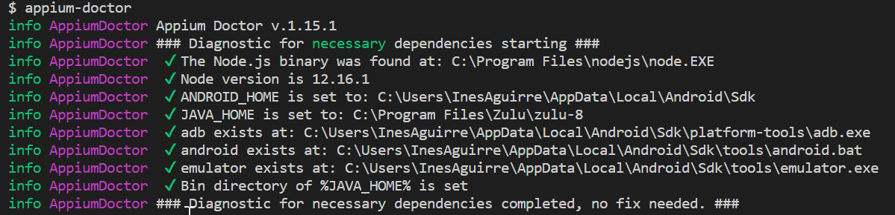
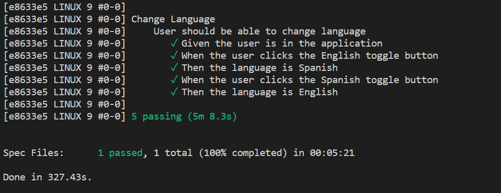

# Automated UI Tests

## Table of contents

- [Pre requisites](#pre-requisites-for-ui-tests)
- [Core technologies](#core-technologies-for-ui-tests)
- [Authoring tests](#authoring-ui-tests)
- [Running the tests](#running-the-ui-tests)

## Pre requisites for the UI tests

- Install _Appium Desktop v1.0.17_, which is available for both macOS and Windows on its [GitHub releases page](https://github.com/appium/appium-desktop/releases).
- Open a terminal and run `npm install -g appium appium-doctor`. You might need a version of Visual Studio with C++ tools installed.
- Make sure to run `yarn install` in the root folder to have all the dependencies up to date.
- Change directory into `src/__tests__/e2e` and run `yarn install` to get the e2e project dependencies.
- Run `appium-doctor`, you should see an output like in the image. If you see any error or missing dependecy, please follow the instructions given by the command to install them.


## Core technologies for UI tests

- Appium as test automation server ([more details](http://appium.io/docs/en/about-appium/intro/))
- WebdriverIO as test automation framework ([more details](https://webdriver.io/docs/gettingstarted.html))
- Cucumber as tool for written BDD UI tests ([more details](https://cucumber.io/docs/guides/overview/#what-is-cucumber))
- Chai as assertion library ([more details](https://www.chaijs.com/))

## Authoring UI tests

### Features

The `.feature` files go within `__tests__\e2e\tests\features`.

The basic structure of a feature goes as follows: ([more details](https://cucumber.io/docs/gherkin/reference/))

```
Feature: Example

  # You can include multiple scenarios in a feature
  Scenario: User clicks a button
    Given the app is active
    When the user clicks the button
    Then the user sees the change
```

### Steps
The steps files `name.steps.ts` go inside `__tests__\e2e\tests\steps`;

There are a few rules for step definitions ([more details](https://cucumber.io/docs/gherkin/step-organization/#writing-step-definitions))
  - The steps should not be bound to a specific feature, you should not define a steps file per feature.
  - You can't have two steps with the same name defined.
  - Try to tackle one action within a step and avoid conjunction.

```
Given(/^the app is active$/, function () {
  //TODO
});

```

### Selectors
To query an element, we use selectors. ([more details](https://webdriver.io/docs/selectors.html))
The recommended way is to use Accessibility ID, in this scenario, we single out an element using the accessibilityLabel property.
That way we can find the element regardless if we are running the app on android or ios.


## Running the UI tests

- On the root folder run either `android` or `ios` to generate the app .apk/.app file.
- Open either `wdio.android.app.conf` or `wdio.ios.app.conf` and modify the `deviceName` property to match the name of the device you'll use for testing.
  - As example, if I wanted to run the tests on my Android phone `deviceName` should be `Redmi Note 7 - 9`. Simulators work fine for iOS, but for Android try to test in a real device when possible since the emulator's performance is quite bad.
- Open _Appium Desktop_ and start the server.
- Now run either `yarn test:e2e:android` or `yarn test:e2e:ios` to run the tests. If everything went fine, the tests should execute and you should receive an output like the following:


**If Appium cannot find the .app in iOS, please modify the Build path in XCode and the `appium:app` capability to match. More info at https://stackoverflow.com/questions/5952782/where-is-xcodes-build-folder**